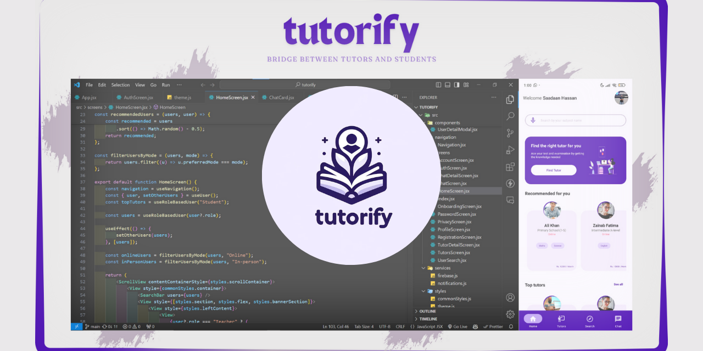

<div align="center">
  
  <h2>Tutorify - Connect Students and Tutors</h2>
  <p>A mobile application designed to connect students and tutors, allowing students to find tutors based on their subjects of interest and facilitating communication between them. The app also includes a map feature to view each other's locations.</p>

[]()
[]()
[]()
[]()
[]()

</div>

## 📋 Features

- **User Profiles:** Students and tutors can create and manage their profiles.
- **Search Functionality:** Students can search for tutors based on subjects.
- **Map Integration:** Tutors and students can view each other's locations on a map.
- **Push Notifications:** Get notified about new messages and user activities.
- **Onboarding Experience:** Users get a guided tour of the app features on their first visit.

## 🗺️ Table of Contents

- [Technologies Used](#-technologies-used)
- [Installation](#-installation)
- [Configuration](#-configuration)
- [Running the App](#-running-the-app)
- [Building the App](#-building-the-app)
- [Contributing](#-contributing)
- [License](#-license)

## 🚀 Technologies Used

- **React Native:** For building the mobile app.
- **Expo:** For development and build tools.
- **Firebase:** For backend services including authentication and storage.
- **Mapbox:** For map and location services.
- **Yarn:** For dependency management.
- **EAS (Expo Application Services):** For building and deploying the app.

## 📦 Installation

To get started with Tutorify, watch the following video to set up the project on your local machine:

[WATCH THE VIDEO](https://youtu.be/kKrzeoiHyIo)

[](https://youtu.be/kKrzeoiHyIo)

Or follow the steps below:

### 1. Clone the Repository

```bash
git clone https://github.com/Saadaan-Hassan/Tutorify.git
cd tutorify
```

### 2. Install Dependencies

Make sure you have Node.js and Yarn installed. If not installed, you can download them from the following links:

- [Node.js](https://nodejs.org/)

After installing Node.js, you can install Yarn using the following command:

```bash
npm install --global yarn
```

Now, install the project dependencies:

```bash
yarn install
```

## ⚙️ Configuration

### 1. Set Up Firebase

Create a Firebase project and obtain the configuration details from the Firebase Console. Follow these steps:

1. Go to the [Firebase Console](https://console.firebase.google.com/).
2. Create a new project, select the platform as "Web," and register the app.
3. Navigate to "Project Settings" and find your Firebase configuration details.
4. Add the following environment variables to your `.env` file in the project root directory:

```env
FIREBASE_API_KEY=your-firebase-api-key
FIREBASE_AUTH_DOMAIN=your-firebase-auth-domain
FIREBASE_PROJECT_ID=your-firebase-project-id
FIREBASE_STORAGE_BUCKET=your-firebase-storage-bucket
FIREBASE_MESSAGING_SENDER_ID=your-firebase-messaging-sender-id
FIREBASE_APP_ID=your-firebase-app-id
```

5. Enable Firebase Authentication, Firestore, and Storage services in the Firebase Console.

### 2. Set Up Mapbox

Create a Mapbox account and obtain your Mapbox API access token:

[WATCH THE VIDEO](https://youtu.be/nQueIo4Rvek)

[](https://youtu.be/nQueIo4Rvek)

Or follow these steps:

1. Go to the [Mapbox website](https://www.mapbox.com/).
2. Sign up for an account or log in to your existing account.
3. Go to the "Tokens" section and create a new access token.
4. Copy the access token and add it to your `.env` file:

```env
RN_MAPBOX_ACCESS_TOKEN=your-mapbox-access-token
```

5. Copy the public access token and add it to your `.env` file:

```env
RN_MAPBOX_MAPS_DOWNLOAD_TOKEN=your-mapbox-public-token
```

### 3. Set Up EAS (Expo Application Services)

[WATCH THE VIDEO](https://youtu.be/OftUidMky2o)

[](https://youtu.be/OftUidMky2o)

Or follow these steps:

1. Go to the [Expo website](https://expo.dev/).
2. Log in to your Expo account, click the Profile icon, and go to the "Projects" section.
3. Create a new project.
4. Obtain your EAS project ID and add it to your `.env` file:

```env
EAS_PROJECT_ID=your-eas-project-id
```

5. Write your Expo username in the `.env` file:

```env
EXPO_OWNER=your-expo-username
```

6. Run the following commands in your project root directory:

```bash
npm install --global eas-cli
eas login
eas build:configure
```

7. The above command will create an `eas.json` file in your project root directory. In the development profile section of the `eas.json` file, add the following configuration:

```json
"development": {
  "developmentClient": true,
  "distribution": "internal",
  "env": {
    "ANDROID_PACKAGE": "YOUR_ANDROID_PACKAGE_NAME",
  }
}
```

8. Add the `ANDROID_PACKAGE_NAME` in the `.env` file:

```env
ANDROID_PACKAGE_NAME=your-android-package-name
```

9. Run the following command to upload the .env file to EAS:

```bash
eas secret:push --scope project --env-file ./.env
```

10. Create a development build:

```bash
eas build --profile development --platform android
```

### 4. Set Up Expo Notifications

[WATCH THE VIDEO](https://youtu.be/QsBSGWa0MPw)

[](https://youtu.be/QsBSGWa0MPw)

Or follow these steps:

1. To set up expo-notifications, you need the `google-services.json` file for the project. Follow the instructions [here](https://docs.expo.dev/push-notifications/fcm-credentials/) to add the `google-services.json` file to the project.
2. Run the following command to upload the `google-services.json` file to EAS:

```bash
eas secret:create --scope project --name GOOGLE_SERVICES_JSON --type file --value ./path/to/google-services.json
```

## 🏃 Running the App

Before running the app, you need to create a development build. Follow these steps:

### 1. Build a Development Client

```bash
eas build --profile development --platform android
```

Install the resulting development build on your device or emulator.

### 2. Start the Development Server

```bash
yarn start
```

## 🛠️ Building the App

To create a production build of the app:

### Build for Android

```bash
eas build --platform android
```

### Build for iOS

```bash
eas build --platform ios
```

## 🤝 Contributing

We welcome contributions to Tutorify! If you have suggestions or want to help improve the project, please follow these guidelines:

1. **Fork the Repository** and create a new branch for your changes.
2. **Make Your Changes** and ensure that your code follows the existing style and guidelines.
3. **Write Tests** for your changes if applicable.
4. **Submit a Pull Request** with a clear description of your changes.

For more details, please refer to the [CONTRIBUTING.md](CONTRIBUTING.md) file.

## 📄 License

This project is licensed under the [GPL-3.0 License](LICENSE).
